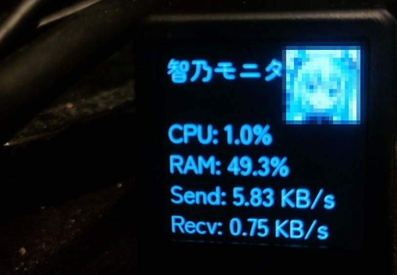
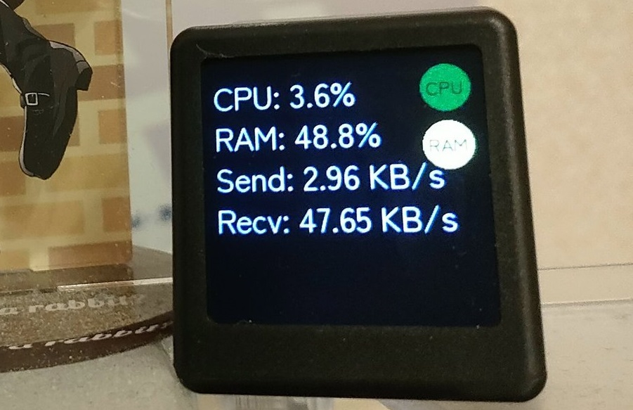

## GeekMagic CPU usage

Mini resource monitor script for use with GeekMagic device

## Example

## Requirements
- Windows 10
- Python 3.10 or upper

## How to use
- 1 Clone this repository
  - `git clone `
- 2 Install python dependencies
  - `pip install -r requirements.txt`
- 2 Open main.py in the repository folder
- 3 Change below constants
  - `DEVICE_IP` with your GeekMagic device IP
  - `UPDATE_INTERVAL` with any value you like
    - 0 second interval sometimes raises error
  - `FONT_PATH` with your ttf font file name
- 4 Paste your resources into folder
  - {YOUR_FONT_NAME}.ttf
  - assets/lv_1.jpg
  - assets/lv_2.jpg
  - assets/lv_3.jpg
  - assets/lv_4.jpg
  - assets/lv_5.jpg
- 5 Run the script
  - `python main.py`
- 6 It should be work
  - Please change some codes if it doesn't work

## LICENSE
MIT